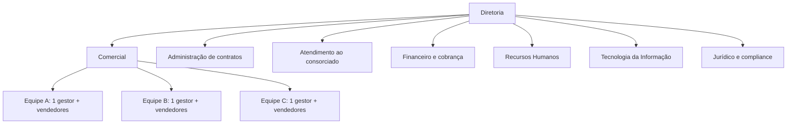
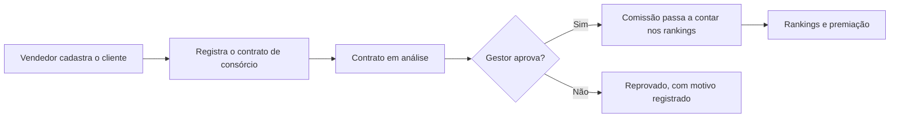

# ADMcom Administradora de Consórcios — Caracterização da organização

## 1. Identificação da organização

| Item | Descrição |
|---|---|
| **Nome** | ADMcom Administradora de Consórcios (nome provisório) |
| **Natureza** | Empresa fictícia de capital privado, criada para o PIM II |
| **Setor** | Financeiro, com atuação na administração de consórcios |
| **Porte** | Pequeno, com cerca de 65 funcionários |
| **Unidades** | Sede e uma filial (cidades a definir) |
| **Regulação** | Atua sob autorização e fiscalização do Banco Central do Brasil, como toda administradora de consórcios |
| **Modelo de negócio** | Venda e administração de contratos de consórcio, por uma equipe comercial remunerada com comissão |

---

## 2. Ramo de atuação

**Administração de consórcios.** A empresa vende e administra **contratos de consórcio**: o cliente adere a um grupo, paga parcelas mensais sem juros de financiamento e concorre à contemplação para adquirir o bem ou serviço desejado.

O foco deste projeto é a **área comercial**, ou seja, o processo de venda dos contratos, a aprovação, a comissão dos vendedores e a gamificação do desempenho.

---

## 3. Missão, visão e valores

**Missão**
Facilitar a conquista de bens e serviços por meio de contratos de consórcio acessíveis, com transparência, segurança e atendimento próximo, valorizando as pessoas que constroem esse resultado.

**Visão**
Ser reconhecida como uma administradora de consórcios ágil, transparente e movida por tecnologia e pelo engajamento de suas equipes.

**Valores**
- Transparência com clientes e colaboradores
- Ética e proteção de dados (LGPD)
- Meritocracia e reconhecimento do desempenho
- Colaboração entre equipes
- Inovação

---

## 4. Principais produtos e serviços

| Produto / serviço | Descrição |
|---|---|
| **Contrato de consórcio** | Produto principal. Cota de consórcio vendida ao cliente, vinculada a um tipo de consórcio e a um valor de crédito |
| **Tipos de consórcio** | Cadastrados e mantidos pelo administrador do sistema (tabela `TipoConsorcio`) |
| **Atendimento ao consorciado** | Esclarecimento de dúvidas, acompanhamento e suporte pós-venda |
| **Cobrança e acompanhamento financeiro** | Controle das parcelas e dos pagamentos |
| **Programa de desempenho comercial** | Serviço interno: comissão por venda, rankings e premiações para a equipe de vendas |

---

## 5. Estrutura organizacional

### 5.1 Organograma

### 5.2 Setores e quantidade de pessoas

| Setor | Pessoas | Função principal |
|---|---|---|
| Diretoria | 3 | Direção geral, estratégia e definição de metas |
| Comercial | 25 | 3 gestores e 22 vendedores, divididos em 3 equipes de vendas |
| Administração de contratos | 10 | Conferência documental e organização dos contratos |
| Atendimento ao consorciado | 8 | Suporte e relacionamento pós-venda |
| Financeiro e cobrança | 8 | Cobrança das parcelas e pagamento das comissões |
| Recursos Humanos | 4 | Gestão de pessoas, metas e premiações |
| Tecnologia da Informação | 5 | Infraestrutura, segurança e sistemas (inclui o administrador do sistema) |
| Jurídico e compliance | 2 | Conformidade regulatória e proteção de dados |
| **Total** | **65** | |

### 5.3 Perfis de usuário do sistema

| Perfil | Quem é | O que faz |
|---|---|---|
| **Vendedor** | Integrante de uma equipe de vendas | Cadastra clientes e contratos, acompanha rankings e eventos |
| **Gestor** | Líder de uma equipe de vendas | Aprova ou reprova contratos, gerencia sua equipe, administra a competição interna e define eventos e prêmios |
| **Admin** | Administrador do sistema (TI) | Gerencia equipes, gestores, tipos de consórcio e o ranking geral, e consulta o log de auditoria |

---

## 6. Principais processos de negócio

### 6.1 Fluxo principal de venda

### 6.2 Descrição dos processos

1. **Prospecção e atendimento:** o vendedor capta o cliente e apresenta o consórcio.
2. **Cadastro do cliente:** registro dos dados e do consentimento LGPD.
3. **Registro do contrato:** o vendedor informa o tipo de consórcio e o valor do crédito; o contrato nasce com status *em análise* e a comissão é calculada.
4. **Aprovação pelo gestor:** o gestor da equipe aprova o contrato ou o reprova, informando o motivo.
5. **Contagem no ranking:** só contratos aprovados contam. A comissão do vendedor passa a compor sua pontuação.
6. **Competições:** o **ranking geral** reúne todos os vendedores de todas as equipes. Cada gestor administra o **ranking interno** da sua equipe, com período definido.
7. **Premiação:** os três primeiros colocados de cada competição (1º, 2º e 3º lugares) recebem prêmios definidos pelo gestor.
8. **Gestão e auditoria:** o admin gerencia equipes, usuários e tipos de consórcio, e as exclusões e arquivamentos ficam registrados em log.

**Processos de apoio:** atendimento pós-venda, cobrança das parcelas, pagamento das comissões (Financeiro) e gestão de metas e premiações (RH).

---

## 7. Público-alvo

**Externo (clientes da empresa)**
Pessoas físicas e pequenos empresários que desejam adquirir bens ou serviços de forma planejada, sem pagar juros de financiamento.

**Interno (usuários do sistema)**
- Vendedores das equipes comerciais
- Gestores das equipes
- Administrador do sistema

---

## 8. Problemas identificados

- **Comissões manuais e lentas:** o cálculo é feito em planilhas, com risco de erro e demora na conferência.
- **Falta de padronização na aprovação:** não há fluxo único para o gestor aprovar ou reprovar contratos, nem registro do motivo.
- **Pouca visibilidade do desempenho:** o vendedor só sabe seus resultados depois do fechamento.
- **Baixo engajamento da equipe de vendas:** sem retorno rápido nem reconhecimento visível, a motivação cai.
- **Gestores sem comparativo entre equipes:** falta uma visão do desempenho relativo para estimular a melhoria.
- **Controle de acesso e proteção de dados frágeis:** dados de clientes (CPF, renda, contato) sem separação por perfil e sem registro de consentimento, o que traz risco perante a LGPD.

---

## 9. Justificativa da solução proposta

A solução é um **sistema de gamificação comercial e comissões**, desenvolvido em linguagem C com banco de dados SQLite, que:

- **calcula automaticamente a comissão** de cada contrato e a registra no momento do cadastro;
- **padroniza a aprovação** do gestor, com status e motivo de reprovação;
- **gera rankings atualizados** a cada contrato aprovado, com um ranking geral (todos os vendedores) e rankings internos (por equipe), premiando do 1º ao 3º lugar;
- **separa o acesso por perfil** (vendedor, gestor e admin) e registra o consentimento LGPD dos clientes;
- **mantém um log de auditoria** das exclusões e arquivamentos.

**Benefícios esperados**

| Problema | Como a solução ajuda |
|---|---|
| Comissões manuais e lentas | Cálculo automático no registro do contrato |
| Aprovação sem padrão | Fluxo único: em análise, aprovado ou reprovado com motivo |
| Pouca visibilidade | Ranking que sobe a cada venda aprovada |
| Baixo engajamento | Competição com prêmios para o 1º, 2º e 3º lugares |
| Gestores sem comparativo | Gestores acompanham os rankings das demais equipes |
| Dados sem proteção | Acesso por perfil, consentimento LGPD e auditoria |

---

## 10. Pendências para fechar

- [ ] Nome definitivo da empresa
- [ ] Cidades da sede e da filial
- [ ] Ano fictício de fundação
- [ ] Quantidade final de equipes e de vendedores por equipe
- [ ] Quem administra o ranking geral (admin ou um gestor)
- [ ] Prêmios (o gestor define; descrever exemplos quando o grupo decidir)
- [ ] Confirmar com o professor se a estrutura por setores, enxuta, é suficiente
- [ ] Confirmar se o texto precisa de algo além de "contratos de consórcio" como produto
